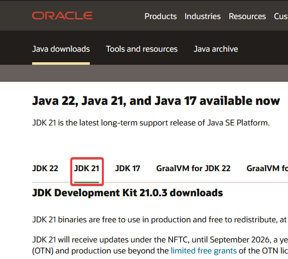
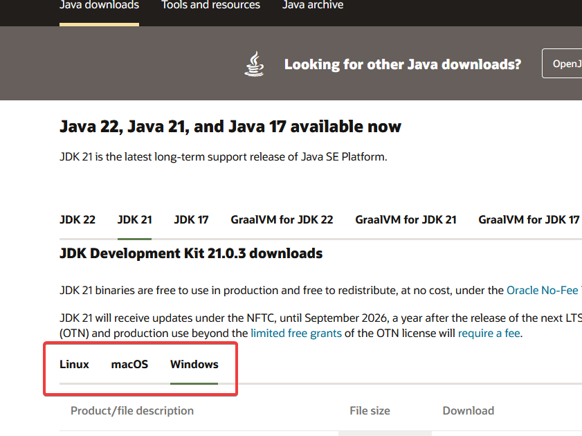
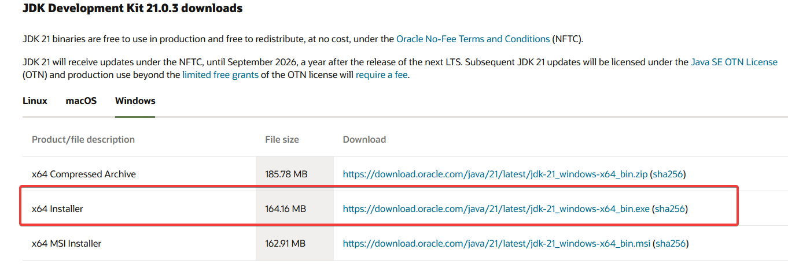
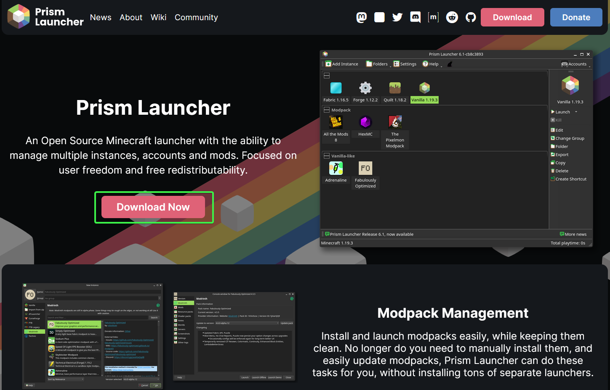
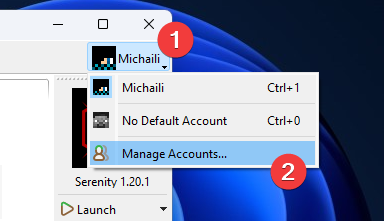
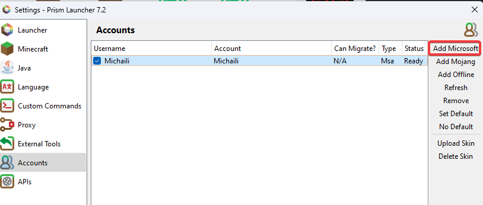
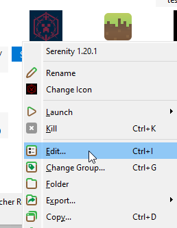
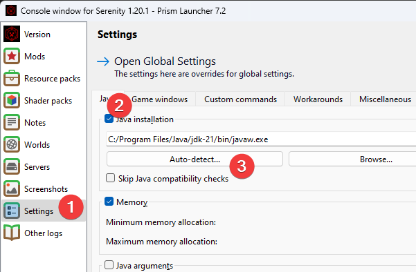
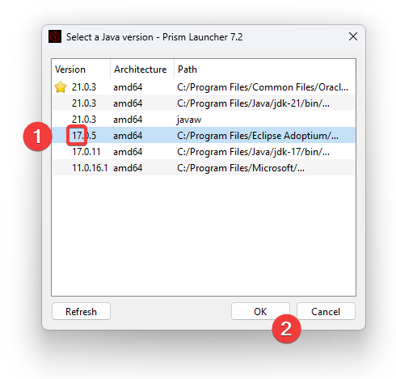

# Installation

## 1. Installing Java 17

1. Go to the [Oracle Java website](https://www.oracle.com/java/technologies/downloads/#jdk21)
   and pick Java 21\
   

2. Pick your operating system (Windows, macOS, or Linux):\
   

3. Download the installer and run it:\
   

## 2. Installing Prism Launcher

### Downloading the Launcher

1. Go to the [Prism Launcher website](https://prismlauncher.org/) and hit the
   download button:\
   

2. Download the installer and follow its instructions.

### Logging into your Minecraft account

1. Open the Prism Launcher, click on the Minecraft Skin icon on the top right,
   and hit "Manage Accounts"\
  

2. Hit "Add Microsoft" and follow the instructions to log in with your
   Microsoft account.\
  

## 3. Installing the Modpack

### Downloading the Modpack

[Download the modpack here](https://github.com/MichailiK/serenity-modpack/releases/download/self-updating/Serenity.1.20.1.zip).

1. Drag and drop the zip file into Prism Launcher
2. Hit OK at the bottom right.

### Setting Java version

1. Right click the modpack and hit "Edit..."\
   
2. Go to Settings, tick the "Java installation" box, and press the
   Auto-detect button.\
   
3. Pick a Java version that is 17, and hit OK.\
  

You're now good to go! Close the settings, then double-click the modpack 
(or hit the launch button) to start.
