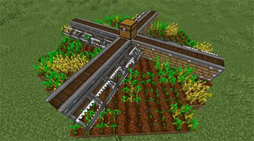
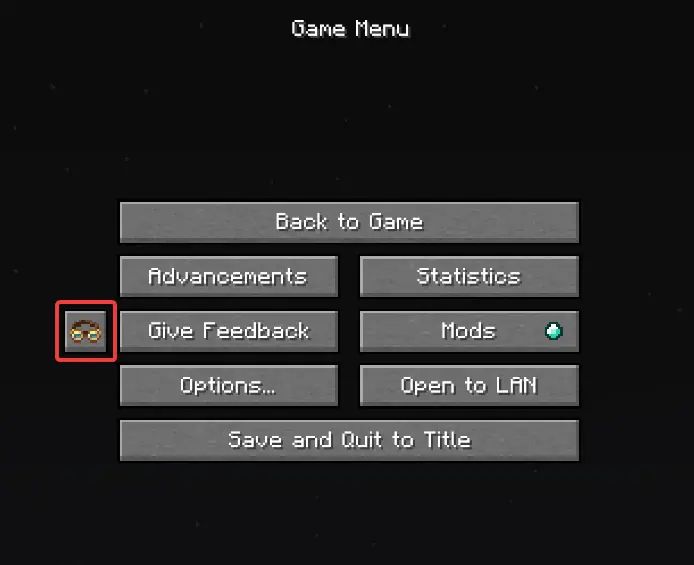
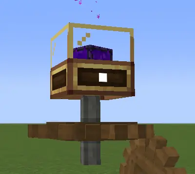

# Mod Introductions

Serenity comes with a bunch of mods. This page will give you a quick run-down
of the ones that affect the gameplay & are important to know. Later on, there
will also be a quick overview to a few quality-of-life mods that are
included in Serenity.

## Table of Contents

- [Major mods](#major-mods)
- [Utility mods](#utility-mods)

## Major mods

This section is currently incomplete.

### Create

Create lets you make advanced Contraptions & automations, for example automated
farming, or trains!

To learn more about Create, use its Ponder Index. It is the goggles in the
pause menu:

#### Create: Power Loader

A mod that keeps chunks loaded, incorporating Create's mechanical systems.
Learn more about chunk loading in Create's Ponder Index.

## Utility mods

to be written